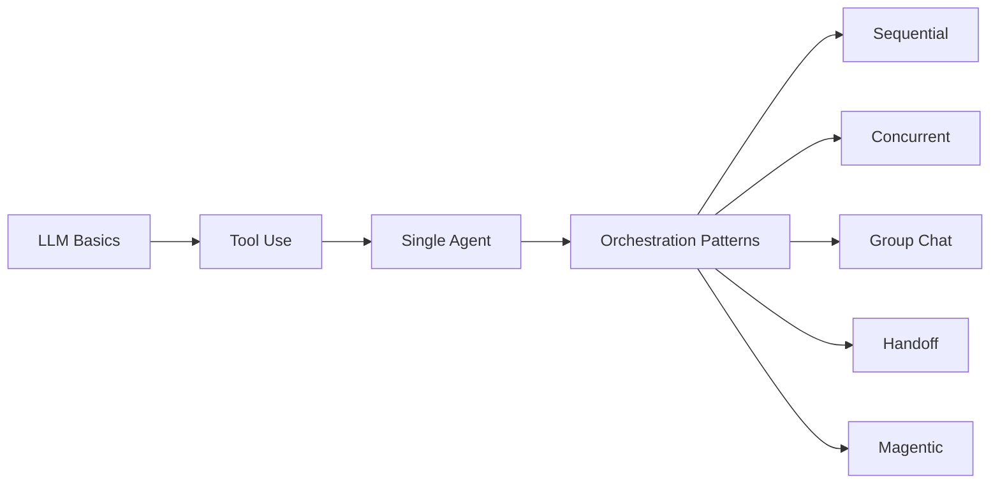

# Agentic AI Design Patterns Workshop

!!! warning "Disclaimer"
    This is **not** an official Microsoft product, does not represent official Microsoft learning materials, product documentation, or official statements by Microsoft Corporation. The content, opinions, and recommendations presented herein are the authors' own, provided solely for educational purposes, and should not be construed as official Microsoft guidance or endorsement.

Welcome to the **Agentic AI Design Patterns Workshop** — a hands-on, multi-part workshop that teaches you how to build AI agents and multi-agent systems using **pure Python and the OpenAI SDK**. No AI frameworks required.

:material-share-variant: **Spread the word** — if you find this workshop useful, share it with your network!

<a class="share-cta__btn share-cta__btn--linkedin" href="https://www.linkedin.com/sharing/share-offsite/?url=https%3A%2F%2Fgithub.com%2Fjeffreygroneberg%2FAI_Workshop_Agentic_Patterns" target="_blank" rel="noopener" title="Share on LinkedIn">
:fontawesome-brands-linkedin: LinkedIn
</a>
<a class="share-cta__btn share-cta__btn--x" href="https://x.com/intent/tweet?text=Check%20out%20this%20hands-on%20workshop%20on%20Agentic%20AI%20Design%20Patterns%20%E2%80%94%20pure%20Python%2C%20no%20frameworks!&url=https%3A%2F%2Fgithub.com%2Fjeffreygroneberg%2FAI_Workshop_Agentic_Patterns" target="_blank" rel="noopener" title="Share on X">
:fontawesome-brands-x-twitter: X
</a>
<a class="share-cta__btn share-cta__btn--substack" href="https://substack.com/share?url=https%3A%2F%2Fgithub.com%2Fjeffreygroneberg%2FAI_Workshop_Agentic_Patterns&title=Agentic%20AI%20Design%20Patterns%20Workshop" target="_blank" rel="noopener" title="Share on Substack">
:fontawesome-brands-stripe-s: Substack
</a>
<a class="share-cta__btn share-cta__btn--reddit" href="https://www.reddit.com/submit?url=https%3A%2F%2Fgithub.com%2Fjeffreygroneberg%2FAI_Workshop_Agentic_Patterns&title=Agentic%20AI%20Design%20Patterns%20Workshop" target="_blank" rel="noopener" title="Share on Reddit">
:fontawesome-brands-reddit-alien: Reddit
</a>
<a class="share-cta__btn share-cta__btn--hn" href="https://news.ycombinator.com/submitlink?u=https%3A%2F%2Fgithub.com%2Fjeffreygroneberg%2FAI_Workshop_Agentic_Patterns&t=Agentic%20AI%20Design%20Patterns%20Workshop" target="_blank" rel="noopener" title="Share on Hacker News">
:fontawesome-brands-hacker-news: Hacker News
</a>
<a class="share-cta__btn share-cta__btn--github" href="https://github.com/jeffreygroneberg/AI_Workshop_Agentic_Patterns" target="_blank" rel="noopener" title="Star on GitHub">
:fontawesome-brands-github: Star on GitHub
</a>

## What You'll Learn

By the end of this workshop you will understand:

1. How LLMs work as building blocks (chat completions, system prompts, structured outputs)
2. How to give LLMs tools and build the core agent loop (Reason → Act → Observe)
3. Five multi-agent orchestration patterns and when to use each one
4. How context flows between agents in each pattern
5. Practical considerations: reliability, human-in-the-loop, and choosing the right pattern

## Learning Path

## Workshop Structure

| Part | Topics | Exercises |
|------|--------|-----------|
| **Part 1** | LLM fundamentals, tool use, single agents | `00_setup` → `03_single_agent` |
| **Part 2** | Sequential, concurrent, group chat patterns | `04_sequential` → `06_group_chat` |
| **Part 3** | Handoff, magentic, implementation topics | `07_handoff` → `08_magentic` |

## Philosophy

This workshop deliberately avoids AI agent frameworks. Instead, you build everything from scratch using:

- **[OpenAI Python SDK](https://github.com/openai/openai-python){:target="_blank"}** — the `openai` package for LLM calls
- **[Pydantic](https://docs.pydantic.dev/latest/){:target="_blank"}** — for structured outputs and tool parameter schemas
- **Python standard library** — `logging`, `dataclasses`, `concurrent.futures`, `pathlib`

By building each pattern yourself, you understand *exactly* what frameworks like the **[Microsoft Agent Framework](https://learn.microsoft.com/en-us/agent-framework/){:target="_blank"}** do under the hood. This makes you a better user of any framework you choose later.

## Provider Flexibility

Every exercise works with any of these providers — just set `LLM_PROVIDER` in your `.env`:

| Provider | `LLM_PROVIDER` | What You Need |
|----------|----------------|---------------|
| GitHub Models | `github` | GitHub token (free tier available) |
| OpenAI | `openai` | OpenAI API key |
| Azure AI Foundry | `azure` | Azure OpenAI endpoint + key |

## Getting Started

1. Read the [Setup Guide](setup.md) to configure your environment
2. Work through the [Concepts](concepts/chat-completions-api.md) section to build foundations
3. Tackle each [Pattern](patterns/single-agent.md) with its corresponding exercise
4. Review [Production Considerations](production-considerations/index.md) for real-world engineering challenges

!!! tip "Read first, then code"
    Each pattern has a **documentation page** (you're reading the docs now) and a **hands-on exercise** in the `exercises/` folder. Always read the docs page first to understand *what* and *why*, then open the exercise to see *how* and practice.
